# BâtiFlow CRM — Architecture Complète & Reverse Engineering

> **Audience :** Développeur senior souhaitant comprendre, maintenir, étendre et déboguer chaque couche de BâtiFlow.
> **Niveau :** Technique avancé — chaque couche est détaillée jusqu'au code source.

---

## Table des Matières

1. [Vue d'ensemble globale](#1-vue-densemble-globale)
2. [Stack technologique](#2-stack-technologique)
3. [Architecture en couches — Diagramme](#3-architecture-en-couches--diagramme)
4. [Modules Backend (NestJS)](#4-modules-backend-nestjs)
5. [Authentification & Sécurité](#5-authentification--sécurité)
6. [Base de données — Schéma & Relations](#6-base-de-données--schéma--relations)
7. [Flux Métier Complet (Lifecycle Devis → Chantier)](#7-flux-métier-complet-lifecycle-devis--chantier)
8. [Module RAG & Architecture IA — Deep Dive](#8-module-rag--architecture-ia--deep-dive)
9. [Module WhatsApp — Deep Dive](#9-module-whatsapp--deep-dive)
10. [Frontend React — Architecture & State Management](#10-frontend-react--architecture--state-management)
11. [Système de Notifications](#11-système-de-notifications)
12. [Sécurité, Multi-Tenancy & Isolation des données](#12-sécurité-multi-tenancy--isolation-des-données)
13. [Performance & Scalabilité](#13-performance--scalabilité)
14. [Coûts API & Optimisation](#14-coûts-api--optimisation)
15. [Guide de Débogage par Module](#15-guide-de-débogage-par-module)

---

## 1. Vue d'ensemble globale

BâtiFlow est un **CRM SaaS vertical** spécialisé pour le secteur du bâtiment. Il s'agit d'une application full-stack organisée en deux grandes parties :

```
┌─────────────────────────────────────────────────────────────┐
│                      BÂTIFLOW CRM                          │
│                                                             │
│  ┌───────────────┐        ┌──────────────────────────────┐ │
│  │   FRONTEND    │  HTTP  │         BACKEND              │ │
│  │  React + TS   │◄──────►│  NestJS + Prisma + PostgreSQL│ │
│  │  (Port 5173)  │  REST  │       (Port 3000)            │ │
│  └───────────────┘        └──────────┬───────────────────┘ │
│                                      │                      │
│                           ┌──────────▼──────────┐          │
│                           │   PostgreSQL DB      │          │
│                           │  (Prisma ORM)        │          │
│                           └──────────────────────┘          │
│                                      │                      │
│                           External APIs :                   │
│                           • Meta Graph API (WhatsApp)       │
│                           • OpenRouter / Gemini / Mistral   │
│                           • HuggingFace Router              │
└─────────────────────────────────────────────────────────────┘
```

**Modèle d'exécution :**
- Le frontend est un SPA (Single Page Application) Vite + React.
- Le backend est un serveur NestJS (Node.js) exposant une API REST sur `/api/`.
- Les deux communiquent exclusivement via HTTP/JSON avec JWT Bearer tokens.
- La base de données est PostgreSQL avec Prisma comme ORM type-safe.

---

## 2. Stack Technologique

### Frontend
| Technologie | Rôle | Version |
|---|---|---|
| **React** | Framework UI | 18+ |
| **TypeScript** | Typage statique | 5+ |
| **Vite** | Bundler / Dev server | 5+ |
| **React Router v6** | Routing SPA | 6 |
| **TanStack Query** | Fetching & cache serveur | v5 |
| **Tailwind CSS v4** | Styling utility-first | 4 |
| **Lucide React** | Icônes SVG | latest |

### Backend
| Technologie | Rôle |
|---|---|
| **NestJS** | Framework API (IoC, DI, modules) |
| **TypeScript** | Typage statique |
| **Prisma** | ORM — migrations + client type-safe |
| **PostgreSQL** | Base de données relationnelle |
| **JWT** | Authentification stateless |
| **bcrypt** | Hachage des mots de passe |
| **multer** | Upload de fichiers (médias WhatsApp) |

### Providers IA (configurables via `.env`)
| Provider | Usage | Env var |
|---|---|---|
| **OpenRouter** | LLM principal (Llama 3, etc.) | `OPENROUTER_API_KEY` |
| **Google Gemini** | LLM fallback | `GEMINI_API_KEY` |
| **Mistral AI** | LLM fallback | `MISTRAL_API_KEY` |
| **HuggingFace** | LLM fallback | `HUGGINGFACE_API_KEY` |

---

## 3. Architecture en couches — Diagramme

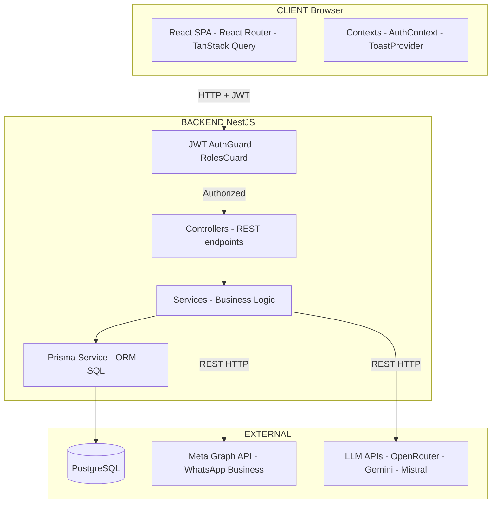

---

## 4. Modules Backend (NestJS)

### 4.1 Carte des Modules

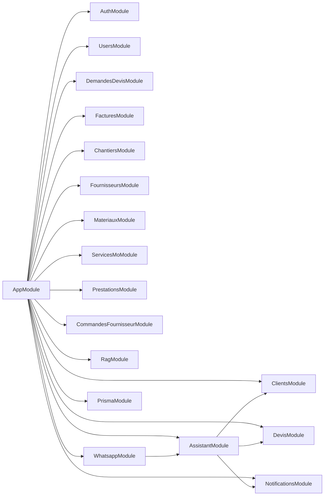

### 4.2 Description de chaque Module

| Module | Endpoints | Rôle Métier |
|---|---|---|
| **Auth** | `POST /auth/login` | Login JWT |
| **Users** | `/users` | CRUD des employés (4 rôles) |
| **Clients** | `/clients` | Base de contacts clients |
| **DemandesDevis** | `/demandes-devis` | Opportunités entrantes |
| **Devis** | `/devis` | Création devis, calcul prix, statuts |
| **Factures** | `/factures` | Génération facture depuis devis |
| **Chantiers** | `/chantiers` | Suivi avancement travaux |
| **Fournisseurs** | `/fournisseurs` | Annuaire fournisseurs |
| **Materiaux** | `/materiaux` | Catalogue matériaux + prix |
| **ServicesMo** | `/services-mo` | Services main d'oeuvre |
| **Prestations** | `/prestations` | Prestations composées |
| **Commandes** | `/commandes-fournisseur` | Commandes de matériaux |
| **Notifications** | `/notifications` | Centre de notifications interne |
| **RAG** | `/rag` | CRUD documents de connaissance IA |
| **Assistant** | `/assistant` | Chatbot IA + RAG + LLM |
| **WhatsApp** | `/whatsapp` | Meta API, webhook, chatbot |

---

## 5. Authentification & Sécurité

### 5.1 Flux d'authentification complet

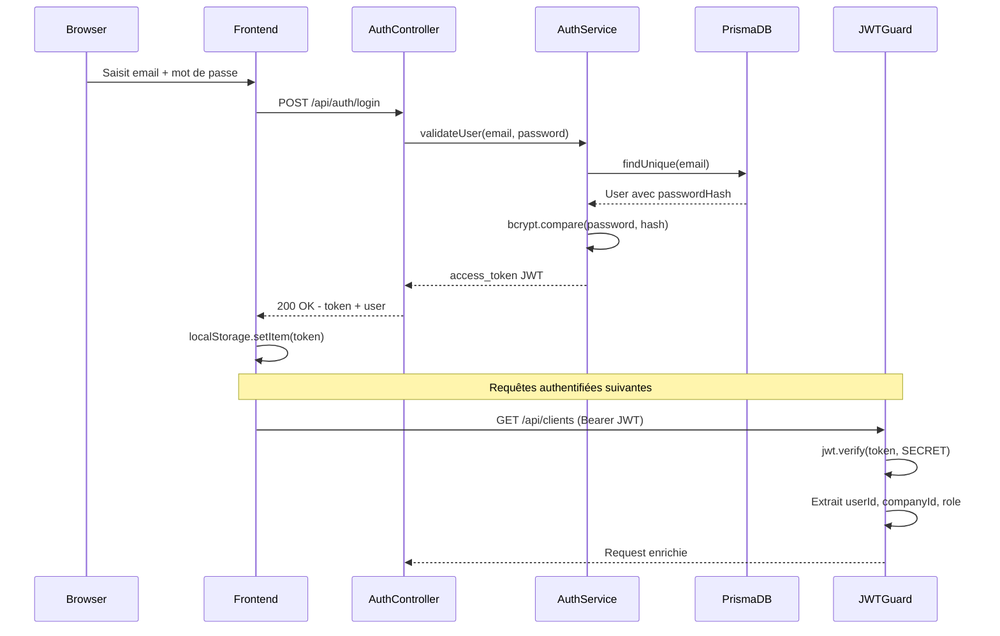

### 5.2 Payload JWT

```typescript
interface JwtPayload {
  sub: number;        // userId
  email: string;
  role: 'ADMIN' | 'ASSISTANTE' | 'CHEF_CHANTIER' | 'TECHNICO' | 'SOUS_TRAITANT';
  companyId: number;  // Clé d'isolation multi-tenant
  iat: number;
  exp: number;
}
```

### 5.3 Matrice des Permissions par Rôle

| Module | ADMIN | ASSISTANTE | CHEF_CHANTIER | TECHNICO | SOUS_TRAITANT |
|---|---|---|---|---|---|
| Dashboard | ✅ | ✅ | ✅ (limité) | ✅ (dédié) | ✅ (portail) |
| Clients | ✅ | ✅ | ❌ | ✅ | ❌ |
| Devis | ✅ | ✅ | ❌ | ✅ | ❌ |
| Chantiers | ✅ | ✅ | ✅ | ❌ | ❌ |
| Tâches chantier | ✅ | ❌ | ✅ | ❌ | ❌ |
| Utilisateurs | ✅ | ❌ | ❌ | ❌ | ❌ |
| Base IA | ✅ | ❌ | ❌ | ❌ | ❌ |
| WhatsApp | ✅ | ✅ | ❌ | ✅ | ❌ |

---

## 6. Base de données — Schéma & Relations

### 6.1 Diagramme Entité-Relation (ERD)

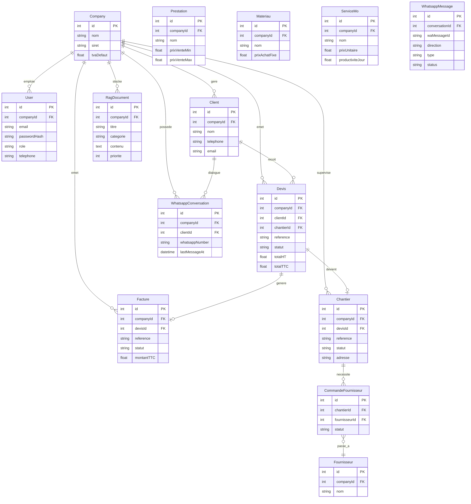

### 6.2 Isolation Multi-Tenant

**Principe clé :** Chaque entité porte un `companyId`. Toutes les requêtes Prisma filtrent sur ce champ.

```typescript
// Exemple dans ClientsService — isolation obligatoire
async findAll(companyId: number) {
  return this.prisma.client.findMany({
    where: { companyId }, // ← Filtré par companyId extrait du JWT
  });
}
```

---

## 7. Flux Métier Complet — Lifecycle Devis → Chantier

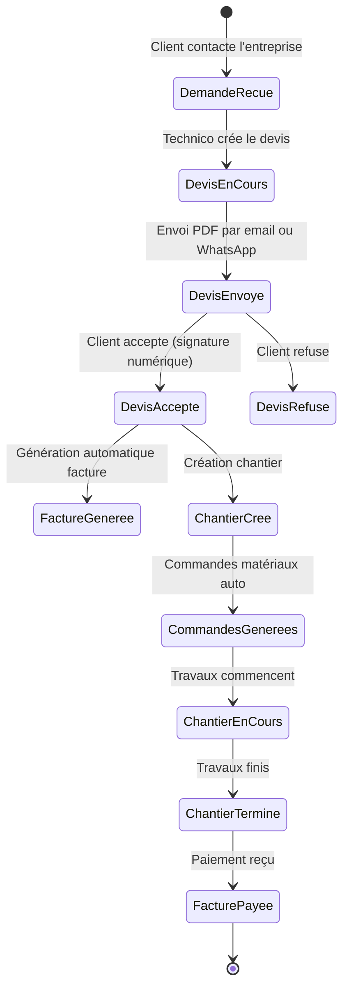

### 7.1 Séquence d'envoi d'un Devis par WhatsApp

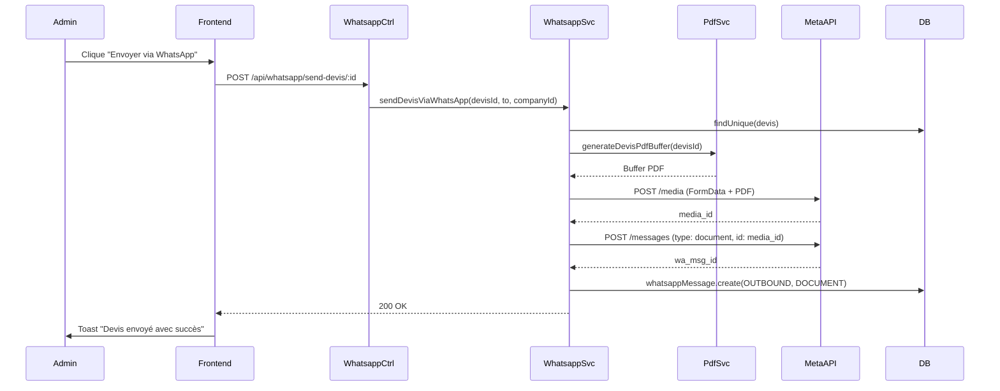

---

## 8. Module RAG & Architecture IA — Deep Dive

### 8.1 Concept RAG

**RAG = Retrieval-Augmented Generation** : On donne au LLM un contexte extrait de la BDD de l'entreprise avant de lui demander de répondre. Cela élimine les hallucinations.

```
Question utilisateur
       │
       ▼
[1] Recherche dans RagDocument (full-text search Prisma)
       │
       ▼
[2] Contexte pertinent assemblé (texte brut)
       │
       ▼
[3] Prompt = Contexte + Question → LLM API
       │
       ▼
[4] Réponse générée, nettoyée, retournée
```

### 8.2 Composants du module IA

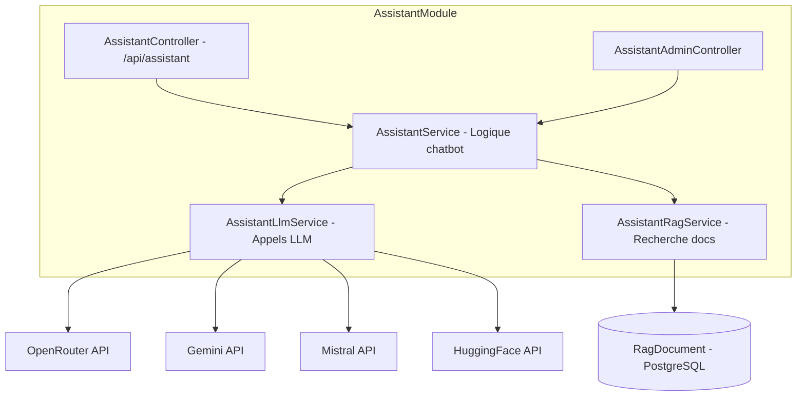

### 8.3 Provider Chain avec Fallback

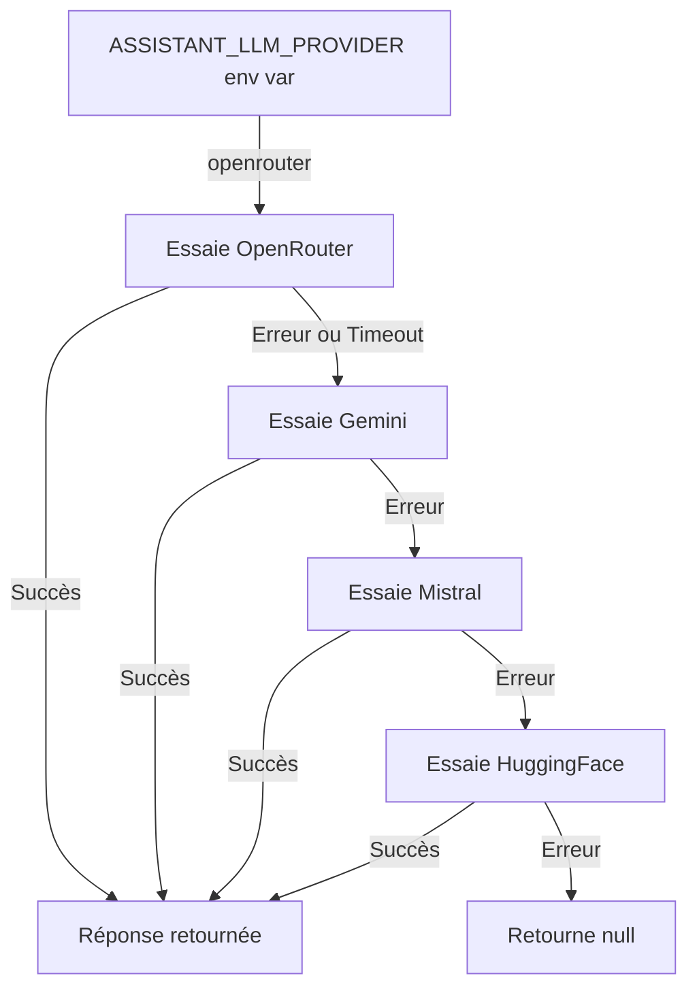

Chaque appel LLM utilise un `AbortController` avec timeout configurable (`ASSISTANT_LLM_TIMEOUT_MS`, défaut 12 000ms).

### 8.4 Extraction de champs avec IA

Quand le chatbot reçoit : *"Je veux refaire ma toiture urgent, appelez Jean au 0612345678"*

L'IA retourne :
```json
{
  "nom": "Jean",
  "telephone": "0612345678",
  "description": "refaire ma toiture",
  "project_type": "toiture",
  "intent": "demande_devis",
  "is_urgent": true,
  "mots_cles": ["toiture", "urgent", "travaux"]
}
```

Le System Prompt impose un JSON strict avec les règles métier (types de projet disponibles, champs obligatoires).

### 8.5 Streaming SSE pour le RAG Manager

Pour le chat interne Manager, le backend supporte le streaming via `generateRagAnswerStream` :

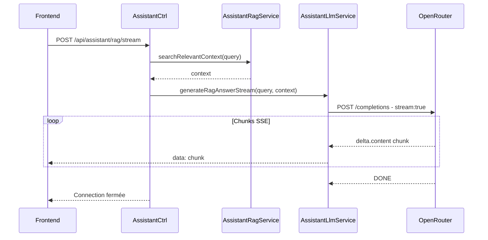

### 8.6 Configuration IA (.env)

```bash
ASSISTANT_LLM_PROVIDER=openrouter   # none|huggingface|mistral|gemini|openrouter|both

OPENROUTER_API_KEY=sk-or-...
OPENROUTER_MODEL=nvidia/llama-3.1-nemotron-70b-instruct

GEMINI_API_KEY=AIza...
GEMINI_MODEL=gemini-2.5-flash

MISTRAL_API_KEY=...
MISTRAL_MODEL=mistral-small-latest

HUGGINGFACE_API_KEY=hf_...
HUGGINGFACE_MODEL=mistralai/Mistral-7B-Instruct-v0.3

ASSISTANT_LLM_TIMEOUT_MS=12000
ASSISTANT_LLM_WORD_LIMIT=70
ASSISTANT_LLM_MAX_CHARS=360
```

---

## 9. Module WhatsApp — Deep Dive

### 9.1 Architecture du Module

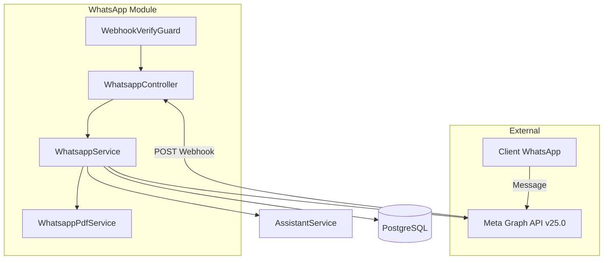

### 9.2 Flux Webhook Entrant

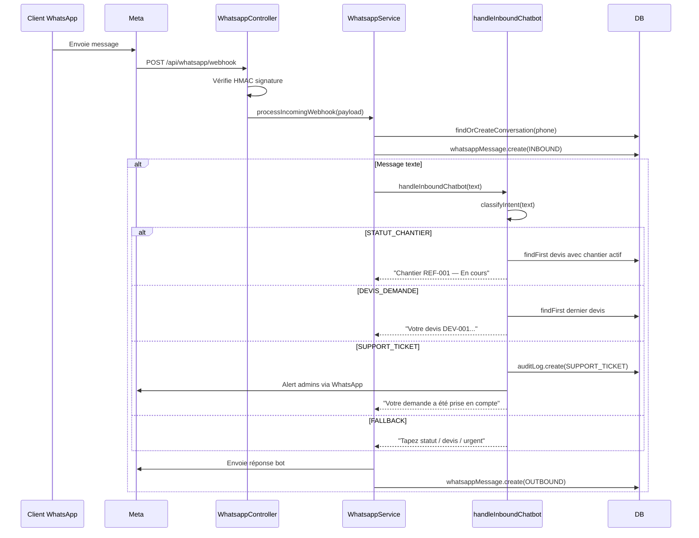

### 9.3 Classification d'intention

```typescript
function classifyIntent(text: string): ChatIntent {
  const lower = text.toLowerCase();
  if (/\b(statut|avancement|chantier|travaux|progression)\b/.test(lower))
    return 'STATUT_CHANTIER';
  if (/\b(devis|offre|estimation|prix|tarif)\b/.test(lower))
    return 'DEVIS_DEMANDE';
  if (/\b(problème|urgent|urgence|panne|incident)\b/.test(lower))
    return 'SUPPORT_TICKET';
  return 'FALLBACK';
}
```

> [!TIP]
> **Extension facile :** Pour ajouter une intention "Prise de RDV", ajoutez un pattern regex et un `case` dans le switch de `handleInboundChatbot`.

### 9.4 Mode Dev vs Production

| Comportement | Mode Dev (sans token) | Mode Production |
|---|---|---|
| `sendRawTextMessage` | Log console uniquement | Appel réel Meta API |
| `uploadMedia` | Retourne `dev-media-id-xxx` | Upload réel vers Meta |
| `sendDocumentMessage` | Retourne `dev-wa-msg-id-xxx` | Envoie réellement |
| Sauvegarde DB | ✅ Toujours | ✅ Toujours |

```typescript
private get isDevMode(): boolean {
  return !process.env.WHATSAPP_ACCESS_TOKEN || !process.env.WHATSAPP_PHONE_NUMBER_ID;
}
```

### 9.5 Étapes de mise en production

1. Créer un compte **Meta Business Manager** → business.facebook.com
2. **Vérifier l'entreprise** (Kbis, facture) dans Business Settings
3. Créer une **app Meta Developer** de type Business avec produit WhatsApp
4. **Ajouter le numéro de téléphone** de l'entreprise (dédié API)
5. Générer un **System User Token permanent** :
   - Business Settings → Utilisateurs Système → Generate Token
   - Permissions : `whatsapp_business_messaging` + `whatsapp_business_management`
6. **Configurer le Webhook** : URL = `https://api.votre-crm.com/api/whatsapp/webhook`
7. Mettre à jour `.env` avec les nouvelles clés

---

## 10. Frontend React — Architecture & State Management

### 10.1 Structure des dossiers

```
frontend/src/
├── components/ui/
│   ├── Toast.tsx          ← Système toast animé (custom)
│   ├── Modal.tsx          ← Dialog réutilisable
│   ├── Form.tsx           ← Composants formulaire
│   └── ConfirmDialog.tsx  ← Dialog de confirmation
├── components/
│   ├── ChatbotWidget.tsx      ← Chatbot public (landing)
│   ├── ManagerAssistantChat.tsx ← Chat IA interne
│   ├── DevisInvoice.tsx       ← Rendu PDF devis
│   └── InternalNotificationsBell.tsx
├── contexts/
│   └── AuthContext.tsx    ← État global auth
├── layouts/               ← 4 layouts selon rôle
├── pages/                 ← 30+ pages
└── types/                 ← Interfaces TypeScript
```

### 10.2 Gestion de l'état

| Besoin | Solution |
|---|---|
| **Auth (user, token)** | `AuthContext` — Context + localStorage |
| **Données serveur** | `TanStack Query` — cache, invalidation |
| **Toast UI** | `ToastProvider` — Context + portal DOM |
| **État formulaire** | `useState` local ou react-hook-form |

### 10.3 Système Toast — Architecture

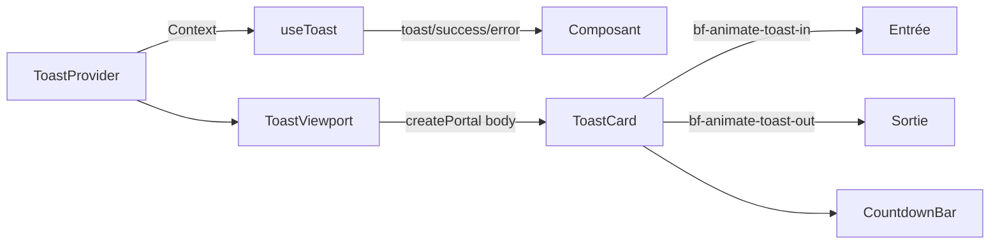

**Animations CSS (index.css) :**
```css
@keyframes bf-toast-in {
  from { opacity: 0; transform: translate3d(120%, 0, 0) scale(0.96); }
  to   { opacity: 1; transform: translate3d(0, 0, 0) scale(1); }
}
@keyframes bf-toast-out {
  from { opacity: 1; transform: translate3d(0, 0, 0) scale(1); }
  to   { opacity: 0; transform: translate3d(120%, 0, 0) scale(0.96); }
}
.bf-animate-toast-in  { animation: bf-toast-in  0.35s cubic-bezier(0.16,1,0.3,1) both; }
.bf-animate-toast-out { animation: bf-toast-out 0.3s cubic-bezier(0.4,0,1,1) both; }
```

**Usage pattern recommandé (Loading → Success) :**
```typescript
const { toast, update } = useToast();
const id = toast({ type: 'loading', title: 'Création en cours...' });
await api.createClient(data);
update(id, { type: 'success', title: 'Client créé !' });
```

---

## 11. Système de Notifications

| Type | Technologie | Usage |
|---|---|---|
| **Toast UI** | React Context + CSS | Feedback immédiat CRUD |
| **Notifications internes** | `AuditLog` PostgreSQL + polling | Alertes persistantes (cloche) |

Les notifications internes utilisent la table `AuditLog` avec un champ `nouvelleValeur` JSON contenant `audience: "INTERNAL"`, `level`, `title`, `message`. Le composant `InternalNotificationsBell` effectue un polling périodique.

---

## 12. Sécurité, Multi-Tenancy & Isolation des données

| Vecteur | Protection |
|---|---|
| **Mots de passe** | bcrypt 10 rounds — jamais en clair |
| **Sessions** | JWT stateless |
| **Isolation données** | `companyId` filtré server-side à chaque requête |
| **Rôles** | `@Roles()` + `RolesGuard` sur chaque endpoint |
| **Validation input** | DTOs avec `class-validator` |
| **Webhook WhatsApp** | Vérification HMAC `X-Hub-Signature-25` |
| **Variables sensibles** | `.env` (jamais dans le code) |

> [!WARNING]
> **JWT sans blacklist** : Un token volé reste valide jusqu'à expiration. En production, envisager des refresh tokens rotatifs ou une blacklist Redis.

> [!CAUTION]
> **Token WhatsApp temporaire (24h)** : En dev, le token expire. En prod, utiliser impérativement un **System User Token permanent** via Meta Business Manager.

> [!NOTE]
> **Pas de rate limiting** actuellement. À ajouter avec `@nestjs/throttler` avant mise en production.

---

## 13. Performance & Scalabilité

### 13.1 Optimisations actuelles

| Domaine | Optimisation |
|---|---|
| **Requêtes DB** | `include` Prisma ciblé |
| **Frontend cache** | TanStack Query `staleTime: 30s` |
| **LLM timeout** | `AbortController` sur tous les appels |
| **Webhook** | Déduplication via `waMessageId` unique |
| **Médias WhatsApp** | Upload direct vers Meta, pas stocké localement |

### 13.2 Scalabilité horizontale

L'architecture est **stateless** côté backend (JWT). Pour scale :
1. **Load balancer** Nginx/Traefik devant plusieurs instances NestJS
2. **Connection pooling** PostgreSQL avec PgBouncer
3. **Cache Redis** pour données fréquentes (types projet, fournisseurs)
4. **File d'attente BullMQ** pour tâches lourdes (PDF, LLM)

---

## 14. Coûts API & Optimisation

### 14.1 Coûts estimés par provider

| Provider | Modèle | Coût / 1M tokens | Usage recommandé |
|---|---|---|---|
| **OpenRouter** | Llama 3.1 Nemotron 70B | ~$0.12 entrée + sortie | Production |
| **Gemini Flash** | gemini-2.5-flash | $0.075 + $0.30 | Fallback rapide |
| **Mistral Small** | mistral-small-latest | $0.20 + $0.60 | Stable |
| **HuggingFace** | Mistral 7B | Pay per compute | Dev uniquement |

### 14.2 Estimation volume PME (100 messages WhatsApp/jour)

| Usage | Volume | Coût estimé |
|---|---|---|
| Extraction champs | 100 req × 300 tokens | < 0.01 €/jour |
| Réponses chatbot | 100 req × 500 tokens | < 0.02 €/jour |
| RAG Manager | 20 req × 2000 tokens | < 0.02 €/jour |
| **Total IA** | | **< 2 €/mois** |

---

## 15. Guide de Débogage par Module

### 15.1 WhatsApp ne reçoit pas les messages

```bash
# 1. Vérifier que l'URL webhook est accessible HTTPS depuis Internet
# En local, utiliser ngrok :
ngrok http 3000
# URL = https://xxx.ngrok.io/api/whatsapp/webhook

# 2. Vérifier WHATSAPP_VERIFY_TOKEN correspond à Meta Console

# 3. En mode dev : vider le token pour basculer en mode démo
WHATSAPP_ACCESS_TOKEN=""
```

### 15.2 L'IA ne répond pas

```bash
# 1. Vérifier le provider
echo $ASSISTANT_LLM_PROVIDER  # ne doit pas être "none"

# 2. Tester la clé API directement
curl -X POST https://openrouter.ai/api/v1/chat/completions \
  -H "Authorization: Bearer $OPENROUTER_API_KEY" \
  -d '{"model":"nvidia/llama-3.1-nemotron-70b-instruct","messages":[{"role":"user","content":"Hello"}]}'

# 3. Les logs NestJS affichent :
# [WARN] LLM provider openrouter failed: [message]
```

### 15.3 Erreur 190 WhatsApp (OAuthException — Token expiré)

```bash
# Solution DEV : mode démo
WHATSAPP_ACCESS_TOKEN=""

# Solution PROD : System User Token permanent
# Meta Business Manager → System Users → Generate Token
# Permissions: whatsapp_business_messaging + whatsapp_business_management
```

### 15.4 Les toasts n'apparaissent pas

```typescript
// Vérifier que le composant est dans <ToastProvider> (main.tsx)
// Vérifier l'import correct
import { useToast } from '@/components/ui/Toast';
const { success } = useToast(); // appel du hook dans le composant
```

### 15.5 Erreur 403 Forbidden

```typescript
// Vérifier :
// 1. Rôle de l'utilisateur dans AuthContext
// 2. @Roles() sur le controller backend
// 3. allowedRoles dans ProtectedRoute frontend
```

---

## Annexe — Fichiers Clés

| Fichier | Rôle |
|---|---|
| `backend/src/app.module.ts` | Enregistrement de tous les modules |
| `backend/src/main.ts` | Bootstrap NestJS, CORS, prefix /api |
| `backend/src/assistant/assistant-llm.service.ts` | Tous les appels LLM (937 lignes) |
| `backend/src/assistant/assistant.service.ts` | Logique chatbot (203KB) |
| `backend/src/whatsapp/whatsapp.service.ts` | Webhook, chatbot, Meta API |
| `backend/src/rag/rag.service.ts` | CRUD documents de connaissance |
| `backend/prisma/schema.prisma` | Schéma complet de la BDD |
| `frontend/src/main.tsx` | Entry point — providers globaux |
| `frontend/src/App.tsx` | Routing complet + rôles |
| `frontend/src/components/ui/Toast.tsx` | Système toast animé |
| `frontend/src/index.css` | Design tokens + animations CSS |
| `frontend/src/contexts/AuthContext.tsx` | État authentification global |
